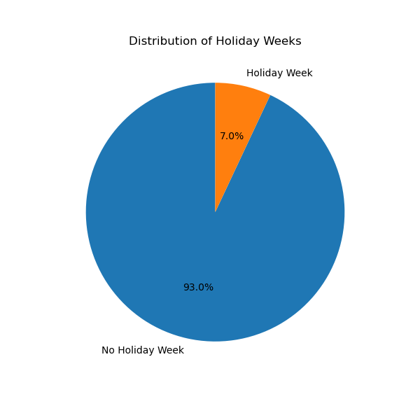
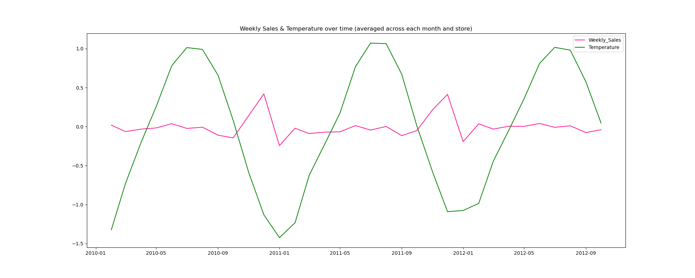
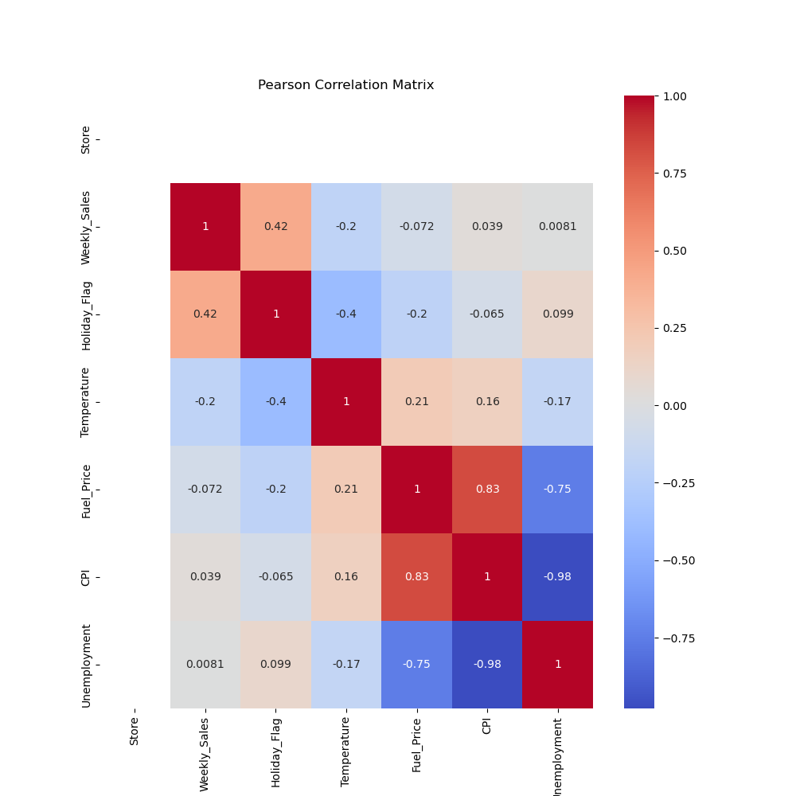
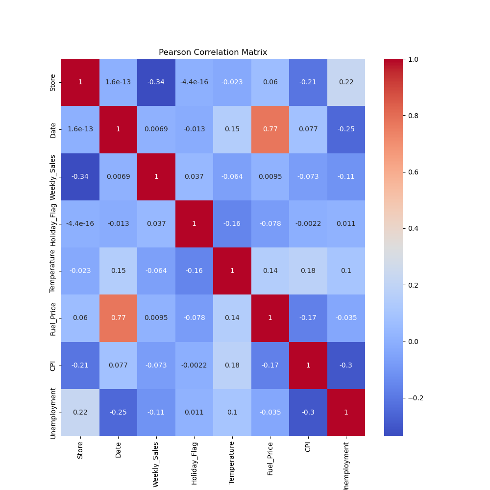
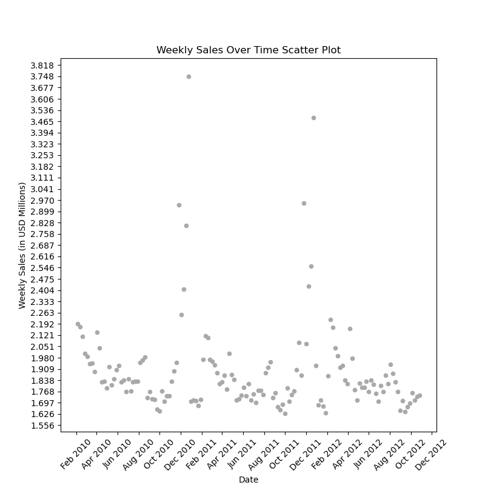

# Data Report On Walmart Sales

Link To [Dataset](https://www.kaggle.com/datasets/mikhail1681/walmart-sales): https://www.kaggle.com/datasets/mikhail1681/walmart-sales

## Table Of Contents
- [Data Report On Walmart Sales](#data-report-on-walmart-sales)
  - [Table Of Contents](#table-of-contents)
  - [Introduction To The Report](#introduction-to-the-report)
  - [Scripting/Running Code](#scriptingrunning-code)
  - [Introduction To Walmart Dataset](#introduction-to-walmart-dataset)
  - [Exploratory Analysis](#exploratory-analysis)
  - [Modeling](#modeling)
    - [Feature Pipeline](#feature-pipeline)
    - [Models \& Methodology](#models--methodology)
    - [Results](#results)
      - [Basic Features](#basic-features)
      - [All Features](#all-features)
  - [Discussion](#discussion)


## Introduction To The Report

The goal of this report aims to explore a Walmart dataset and model it with statistical models such as XGBoost and Linear Regression using the author's current statistical expertise on sales inference and prediction (a regression problem). This report is neither entirely informal nor rigorous; the report is for practice and fun while still adhering to the discipline of accurate, scientific reporting. 

## Scripting/Running Code

The code is spread across 5 Python files. To run the code, first check if Python is installed with `python --version`. Untested if older Python versions would work (3.10+ should reasonably work) but the environment was scripted in Python 3.13.11. You can download Python [here](https://www.python.org/downloads/).

Ensure the [Walmart dataset](https://www.kaggle.com/datasets/mikhail1681/walmart-sales) is downloaded and within the same directory/folder as this *README.md*.

Code chunks are commented out in *main.py* with labels to run particular tasks. Uncomment the desired code tasks and run the file in the directory/folder of this *README.md* with 

```
python main.py
```

Currently, all functions are made to save to the directory/folder specified by `OUTPUT_FOLDER` and `STORE_FOLDER`. You are welcome to change any code, especially the configuration variables (in all capitalizated lettering) at the very top of *main.py*. The names of configuration variables explain their purpose. Note for replication purposes, everything reported in here is configured to `RNG_SEED = 314` unless otherwise specified. As a warning, there may be errors in each file depending on your IDE/environment but those are type checking errors and do not affect runtime so feel free to ignore those. What will be published to the repository <u>will</u> work as intended.

## Introduction To Walmart Dataset

There are 8 columns in the dataset with 6435 entries. There are no null values nor duplicates in the dataset but are preemptively removed anyways.

1) **Store** (*int*): Categorical identifier of 45 sampled Walmart stores
2) **Date** (*string* in DD-MM-YYYY): Start date of recording of sales for the week
3) **Weekly_Sales** (*float*): Sales of the week in USD. Ranges from 210k to 4 million
3) **Holiday_Flag** (*int*): Binary identifier on presence of a business holiday in the week
4) **Temperature** (*float*): Local air temperature of the store in Fahrenheit
5) **Fuel_Price** (*float*): Fuel price in local region per gallon in USD
6) **CPI** (*float*): Consumer price index of store
7) **Unemployment** (*float*): Unemployment rate in region of store

In preparation for the statistical models, new features were created and will be explained in [Feature Pipeline](#feature-pipeline). The following features were engineered in `Dataset.model_pipeline()` in *data_obj.py*:

9)  **Sales_Lag_One** (*float*): Lag feature of **Weekly_Sales** by 1 time period (1 week). First entry is average of **Weekly_Sales**
8) **Date_Continuous** (*float*): Transformation of **Date** into a continuous float for modeling
10)  **Sales_Lag_Two** (*float*): Lag feature of **Weekly_Sales** by 2 time periods (2 weeks). First 2 entries are the average of **Weekly_Sales**
11)  **Cos_Month** (*float*): Cosine transformation on the month of **Date**
12)  **Sin_Month** (*float*): Sine transformation on the month of **Date**
13)  **Peak_Season** (*int*): Binary identifier if the month of **Date** is October, November, or December
14)  **Store_Sales_[\d+]** (*int*): 44 features (**Store_Sales_2**-**Store_Sales_45**) to one hot encode the **Store** feature
15)  **Log_Weekly_Sales**: Logarithmic transformation on **Weekly_Sales** (using `np.log1p()` for stability)

The dataset was found on Kaggle and provided by user *mikhail1681*. No mentioning of data collection methodology is mentioned.

## Exploratory Analysis

Here, we aim to understand the dataset more. We first look at the top 10 of important features. The full results can be found in *output/top_[feature]*. 

| Store | Date       | Weekly_Sales | Holiday_Flag | Temperature | Fuel_Price | CPI          | Unemployment |
|-------|------------|--------------|--------------|-------------|------------|--------------|--------------|
| 14    | 2010-12-24 | 3818686.45   | 0            | 30.59       | 3.141      | 182.54459    | 8.724        |
| 20    | 2010-12-24 | 3766687.43   | 0            | 25.17       | 3.141      | 204.6376731  | 7.484        |
| 10    | 2010-12-24 | 3749057.69   | 0            | 57.06       | 3.236      | 126.9835806  | 9.003        |
| 4     | 2011-12-23 | 3676388.98   | 0            | 35.92       | 3.103      | 129.9845484  | 5.143        |
| 13    | 2010-12-24 | 3595903.20   | 0            | 34.90       | 2.846      | 126.9835806  | 7.795        |
| 13    | 2011-12-23 | 3556766.03   | 0            | 24.76       | 3.186      | 129.9845484  | 6.392        |
| 20    | 2011-12-23 | 3555371.03   | 0            | 40.19       | 3.389      | 212.2360401  | 7.082        |
| 4     | 2010-12-24 | 3526713.39   | 0            | 43.21       | 2.887      | 126.9835806  | 7.127        |
| 10    | 2011-12-23 | 3487986.89   | 0            | 48.36       | 3.541      | 129.9845484  | 7.874        |
| 2     | 2010-12-24 | 3436007.68   | 0            | 49.97       | 2.886      | 211.0646599  | 8.163        |

The table above is the top 10 **Weekly_Sales**. Christmas season highly influences sales where other features lack in significance.



The above is a pie chart on the **Holiday_Flag** distribution in the whole dataset. ~7% of the dataset included a business holiday.



**Weekly_Sales** is part of our objective so we compare it with continuous numerical features (normalized to fit in the plot). Above is 1 of 4 plots located at *output/Weekly_Sales_&_[Feature]_comparison_plot.png*. We average across each month for the selected feature then aggregate across stores. **Temperature** displayed the most interesting result where minima concided peaks in sales, likely a cause of **Date** confounding **Temperature**. 

<!--  -->



The Pearson Correlation allows us an insight on (linear) correlations between features. The above diagram demonstrates very weak correlation signals except between **Date** & **Fuel_Price**, an expected correlation. Both correlation matrices- the above & averaged across stores- can be found at *output/correlation_\*.png*



We finish this section with a sample of **Weekly_Sales** over time.This plot shows the results for Store 10. Similar plots for all 45 stores can be found in the *output/store_[\d+]*. Every store plot demonstrates the same sales peaks during the end of winter.

## Modeling

### Feature Pipeline

When dealing with a time-based data, it is extremely important to administer any work on features without introducing data leakage. 

| Week    | Sales (USD)   | Temperature (F)      | Store      | Sales Average (3 week window in same store) |
|---------|---------------|----------------------|------------|---------------------------------------------|
| 1       |  10,000       | 70                   | 1          | 10,142
| 2       |  10,285       | 72                   | 1          | 10,285
| 3       |  10,571       | 74                   | 1          | 10,428
| 1       |  9,142        | 64                   | 2          | 9,142

If we were to train a model based on the above, the model would easily overfit based on the data leakage of the **Sales Average** feature. This column uses data from the future through the avenue of averaging. To keep statisicians employed and our goal realistic, a column based on averaging would be inappropiate. This carefulness with a temporal series extends into cross validation as well (mentioned in [Models \& Methodology](#models--methodology)). 

Feature 8 (**Date_Continuous**) transforms the *string* format "DD-MM-YYYY" into a digestable *float* for modeling. Features 11 and 12 (**Cos_Month** and **Sin_Month**) recognize the significance of months while avoiding ranking of the month number (e.g: January, the 1st month, is not less than August, the 8th month) for models. Both trigonometric transformations are needed to fully deconstruct ranking in order to transform the month number onto a circle, making it continuous (December follows into January). Lastly for **Date**-related features, it was empirically found in [Exploratory Analysis](#exploratory-analysis) the last 3 months of the year to be significant through exploration of the store graphs in *output/stores*. This likely arises for the numerous significant holidays at the end of the year. Feature 13 (**Peak_Season**) is a binary indicator of the last 3 months for the entry or not.

The range of **Sales** is massive, making it reasonable to transform it into **Log_Weekly_Sales** by $\log(x_i + 1)$ where $x_i$ is a **Sales** entry. The low cardinality (45 categories) of **Store** called for one hot encoding it without **Store_1** (leaving 44 one hot encoded columns from **Store_2**-**Store_45**). The last 2 features are lag features of **Sales**. Feature 9 (**Sales_Lag_One**) is behind 1 week and feature 10 (**Sales_Lag_Two**) behind by 2 weeks. Typically in temporal series regressional problems, lag features provide very powerful context for prediction. Entries that cannot have lag features were not dropped and had their lag features set to the median of **Sales**, allowing for minimal data leaking (will be mentioned in [Discussion](#discussion)).

The following features are L2 normalized: **Temperature**, **Fuel_Price**, **CPI**, **Unemployment**, **Date_Continuous**, **Sales_Lag_One**, **Sales_Lag_Two**. We call "base features" as: **Date_Continuous**, **Temperature**, **Fuel_Price**, **Holiday_Flag**, **CPI**, **Unemployment**, & **Store_Sales_[\d+]**. Note we <u>exclusively</u> use **Log_Weekly_Sales** as our dependent variable in our experiment due to convergence issues with **Weekly_Sales** stemming from its large magnitude.

### Models & Methodology

We use cross validation with a holdout/validation set as 20% of original data. The goal is to predict and infer **Log_Weekly_Sales**. To avoid data leakage, we selected the last 20% of data to holdout. The other data is used to train in cross-validation in 10 folds (using `TimeSeriesSplit()` by `scikit-learn` to respect the temporal series) with the following models & parameters:

- `LinearRegression()`
- `Lasso()`
- `Ridge()`
- `DecisionTreeRegressor(splitter="best")`
- `RandomForestRegressor(n_estimators = 100)`
- `AdaBoostRegressor(n_estimators = 100, learning_rate = 1e-1)`
- `XGBRegressor(n_estimators = 100, learning_rate = 1e-1)`

ElasticNet was considered but the results of Lasso and Ridge justified only the usage of Ridge as seen in [Results](#results). Arguments not provided assume their default arguments according to their package (e.g: `RandomForestRegressor()` from `scikit-learn` defaults to 100 trees for each ensemble Decision Tree). All models come from `scikit-learn` except `XGBRegressor()`- which comes from the `xgb` module. 

We run 2 experiments on `RNG_SEED = 314` with the same hyperparameters previously mentioned. The first experiment models "base features" as a control group. Experiment 2 uses all "base features" alongside our new features **Sales_Lag_One**, **Sales_Lag_Two**, **Cos_Month**, **Sin_Month**, & **Peak_Season**. We evaluate & compare each experiment using the following metrics average fold training MSE, average fold training MAE, average fold training $r^2$, validation MSE, validation MAE, validation $r^2$, & runtime.

### Results

#### Basic Features
| Model                  | Train_MSE | Train_MAE | Train_R2 | Validation_MSE | Validation_MAE | Validation_R2 | Runtime |
|------------------------|-----------|-----------|----------|----------------|----------------|---------------|---------|
| Linear                 | **0.0200**    | **0.0977**    | **0.9460**   | **0.0107**         | **0.0776**         | **0.9675**        | 0.0847  |
| Lasso                  | 0.3509    | 0.4992    | -0.0022  | 0.3301         | 0.4911         | -0.0002       | 0.0619  |
| Ridge                  | 0.0209    | 0.1004    | 0.9432   | 0.0112         | 0.0797         | 0.9660        | **0.0588**  |
| Decision               | 0.0533    | 0.1450    | 0.8510   | 0.0628         | 0.1774         | 0.8097        | 0.3008  |
| Random Forest          | 0.0246    | 0.1084    | 0.9325   | 0.0173         | 0.1056         | 0.9475        | 15.9294 |
| Ada Boost Regression   | 0.2517    | 0.4214    | 0.2819   | 0.2412         | 0.4151         | 0.2692        | 4.2980  |
| XG Boost Regression    | 0.0316    | 0.1252    | 0.9126   | 0.0233         | 0.1174         | 0.9295        | 0.8004  |

#### All Features

| Model                | Train_MSE | Train_MAE | Train_R2 | Validation_MSE | Validation_MAE | Validation_R2 | Runtime |
|----------------------|-----------|-----------|----------|----------------|----------------|---------------|---------|
| Linear               | 0.0199    | 0.0986    | 0.9451   | 0.0067         | 0.0611         | 0.9796        | 0.0696  |
| Lasso                | 0.3509    | 0.4992    | -0.0022  | 0.3301         | 0.4911         | -0.0002       | 0.0494  |
| Ridge                | **0.0151**    | 0.0817    | **0.9592**   | 0.0057         | 0.0566         | 0.9826        | **0.0453**  |
| Decision              | 0.0272    | 0.1051    | 0.9257   | 0.0132         | 0.0863         | 0.9599        | 0.3084  |
| Random Forest        | 0.0152    | **0.0772**    | 0.9591   | **0.0050**         | **0.0527**         | 0.9847        | 18.4238 |
| Ada Boost Regression | 0.0198    | 0.0955    | 0.9463   | 0.0088         | 0.0733         | 0.9734        | 6.5399  |
| XG Boost Regression  | 0.0173    | 0.0805    | 0.9534   | 0.0050         | 0.0536         | **0.9848**        | 4.3997  |


## Discussion

pca reduction/dimensionality reduction

data leakage of median

RF and XG boost perform best but for times sake, pick XG. If time is of bigger constraint, linear/Ridge do just great

https://online.stat.psu.edu/stat501/book/export/html/995